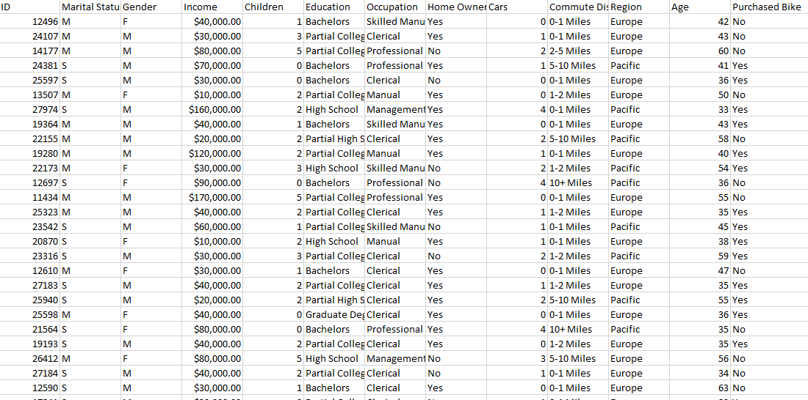
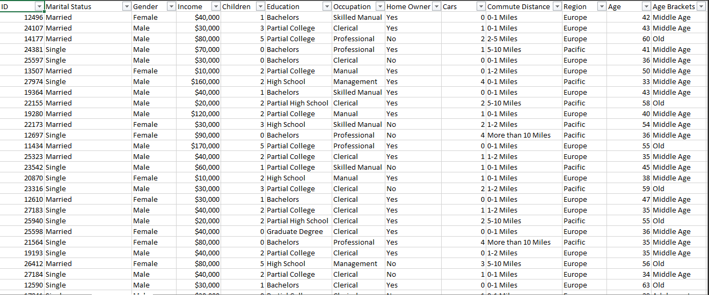
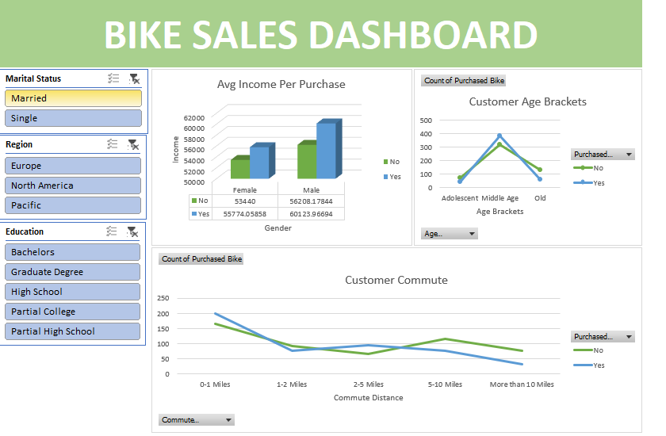

# excel_full_project_analysis
Data cleaning, analysis and dashboard of bike buyers data using Excel

# bike-buyers-excel-analysis

## Overview
This project analyses bike buyers data using Excel. The data was cleaned, 
analysed and visualised through pivot tables and a dashboard across 
multiple sheets.

## Data Source
Dataset sourced from GitHub.

## File
| File | Description |
|------|-------------|
| [bike_buyers.xlsx](Excel_Project_Dataset.xlsx) | Excel file containing all sheets |

## Project Steps

### 1. Raw Data
The original dataset as sourced from GitHub.

### 2. Data Cleaning
The working sheet where duplicates were removed, nulls handled 
and values standardized.

### 3. Pivot Tables
Pivot tables were created to summarise buyers by age, region 
and income before building the dashboard.

### 4. Dashboard
An interactive dashboard built to visualise the findings.

## Tools Used
- Microsoft Excel

## Acknowledgements
This project was guided by [Alex the Analyst](https://www.youtube.com/@AlexTheAnalyst).
